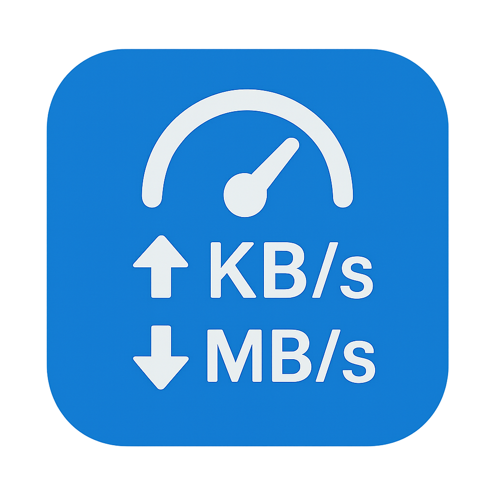

# Winternet Meter

**Winternet Meter** is a lightweight, modern Windows utility that displays your real-time internet upload and download speeds in a floating, always-on-top window. Designed for simplicity and minimal resource usage, it sits quietly in your system tray and offers quick access to customization and controls.

## Features

- **Real-Time Speed Monitoring:** Instantly see your current upload and download speeds, updated every 0.8 seconds.
- **Floating Window:** Always-on-top, resizable, and draggable display for easy visibility.
- **System Tray Integration:** Access all controls and settings from the tray menu.
- **Adapter Selection:** Choose your network adapter or let the app auto-select the best one.
- **Customizable Appearance:** Change text color, font size, and more.
- **Run on Startup:** Option to launch automatically with Windows.
- **Lightweight & Self-contained:** No dependencies—single-file executable.

## Getting Started

1. Download the latest release from the [Releases](https://github.com/rakibulx33/winternet-meter/releases) page.
2. Run the installer and follow the prompts.
3. Find Winternet Meter in your Start menu or system tray.

## Customization
- Change text color and font size from the tray menu.
- Move and resize the floating window as you like.
- Select your preferred network adapter or use auto-select.

## Contributing
Pull requests and suggestions are welcome! For major changes, please open an issue first to discuss what you would like to change.

## License
MIT License

---

> Made with ❤️ by Rax33 (https://github.com/rakibulx33)
